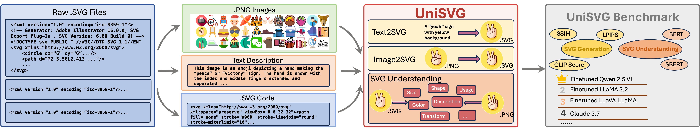

# 🏆 **Accepted to ACM MM 2025 Dataset Track!**

> **UniSVG** has been officially accepted to the **ACM Multimedia 2025 Dataset Track** 🎉  
> [🌐 Project Page](https://ryanlijinke.github.io/) | [🏆 Conference Website](https://acmmm2025.org/)

# UniSVG Dataset

UniSVG is a comprehensive dataset designed for unified SVG generation (from textual prompts and images) and SVG understanding (color, category, usage, etc.). It comprises 525k data items tailored for Multi-modal Large Language Models (MLLM) training and evaluation. You can access the dataset on [Hugging Face](https://huggingface.co/datasets/lili24/UniSVG).



## 🔥 Release

### [2025/07/31]
- 🔥 **UniSVG** got accepted by [🏆 ACM MM 2025 Dataset Track](https://acmmm2025.org/)🎉 [🌐 Project Page](https://ryanlijinke.github.io/) 

### [2025/06/03]
- 🔥 **UniSVG** dataset images updated! [📂 Dataset](https://huggingface.co/datasets/lili24/UniSVG/blob/main/png.zip) [🌐 Project Page](https://ryanlijinke.github.io/) 

### [2025/05/30]
- 🔥 **UniSVG** dataset opensourced! [📂 Dataset](https://huggingface.co/datasets/lili24/UniSVG) [🌐 Project Page](https://ryanlijinke.github.io/) 

## Project Homepage

For more information, please visit the [project homepage](https://ryanlijinke.github.io/).

## Dataset Summary

Unlike bitmap images, scalable vector graphics (SVG) maintain quality when scaled, frequently employed in computer vision and artistic design in the representation of SVG code. In this era of proliferating AI-powered systems, enabling AI to understand and generate SVG has become increasingly urgent. However, AI-driven SVG understanding and generation (U&G) remain significant challenges. SVG code, equivalent to a set of curves and lines controlled by floating-point parameters, demands high precision in SVG U&G. Besides, SVG generation operates under diverse conditional constraints, including textual prompts and visual references, which requires powerful multi-modal processing for condition-to-SVG transformation. Recently, the rapid growth of Multi-modal Large Language Models (MLLMs) have demonstrated capabilities to process multi-modal inputs and generate complex vector controlling parameters, suggesting the potential to address SVG U&G tasks within a unified model. To unlock MLLM's capabilities in the SVG area, we propose an SVG-centric dataset called UniSVG, comprising 525k data items, tailored for MLLM training and evaluation. To our best knowledge, it is the first comprehensive dataset designed for unified SVG generation (from textual prompts and images) and SVG understanding (color, category, usage, etc.).
## Usage

To install the dataset, you can use the `datasets` library from Hugging Face:

```bash
pip install datasets

```
Here is an example of how to load and use the dataset:

```python
from datasets import load_dataset

# Load the dataset
UniSVG_dataset = load_dataset("lili24/UniSVG")

# Print the first example
print(UniSVG_dataset[0])
```
## Finetuning example
After downloading our UniSVG dataset, you can use your preferred models to finetune them on UniSVG/subset of UniSVG. 
We have tried to finetune on the following MLLMs, please feel free to get them: [LLaVA 1.5](https://huggingface.co/llava-hf/llava-1.5-7b-hf), [LLaVA-LLaMA](https://huggingface.co/Intel/llava-llama-3-8b), [LLaVA-Next](https://huggingface.co/llava-hf/llama3-llava-next-8b-hf), [GLM 4V](https://huggingface.co/THUDM/glm-4v-9b), [LLaMA 3.2](https://huggingface.co/meta-llama/Llama-3.2-3B-Instruct), [Qwen 2.5 VL](https://huggingface.co/Qwen/Qwen2.5-VL-7B-Instruct). 

Then please transfer your downloaded UniSVG dataset into LLaMA-Factory version:
Modify and run the following two python files:
```bash
# Make sure you modify these files before using them!
python utils/transfer_to_llava.py
python utils/transfer_to_llama_factory.py
```

As an example, we ultized [LLaMA-Factory](https://github.com/hiyouga/LLaMA-Factory) frame to do the finetuning. We saved one LLaMA-Factory repo [here](https://github.com/Ryanlijinke/unisvg.github.io/tree/main/train/qwen25_llama32/LLaMA-Factory) for your easy use 

Then please added the modified LLaMA-Factory UniSVG json into ["train/qwen25_llama32/LLaMA-Factory/data"](https://github.com/Ryanlijinke/unisvg.github.io/tree/main/train/qwen25_llama32/LLaMA-Factory/data), and modify the ["train/qwen25_llama32/LLaMA-Factory/data/dataset_info.json"](https://github.com/Ryanlijinke/unisvg.github.io/blob/main/train/qwen25_llama32/LLaMA-Factory/data/dataset_info.json) by adding (our provided repo already includes this):
```json
"unisvg": {
  "file_name": "llama_UniSVG_train.json",
  "formatting": "sharegpt",
  "columns": {
    "messages": "messages",
    "images": "images"
  },
  "tags": {
    "role_tag": "role",
    "content_tag": "content",
    "user_tag": "user",
    "assistant_tag": "assistant"
  }
}
```
Congrats! Your UniSVG dataset is finally ready for finetuning! We offer you an example finetuning bash file using deepspeed under LLaMA Factory, please refer to: [/train/qwen25_llama32/train.sh](https://github.com/Ryanlijinke/unisvg.github.io/blob/main/train/qwen25_llama32/train.sh)

⚠️ **Special Warning:** If you interested in different stages training of LLaVA 1.5, LLaVA-LLaMA and LLaVA-Next, the LLaMA-Factory may not support, please using the [LLaVA](https://github.com/haotian-liu/LLaVA) repo for finetuning, we also provided the saved LLaVA repo for easy use [here](https://github.com/Ryanlijinke/unisvg.github.io/tree/main/train/llava_llama/LLaVA).Specially, we modified the training scripts to make it suitable for finetuning LLaVA-LLaMA, for more information, please visit [the training scripts here](https://github.com/Ryanlijinke/unisvg.github.io/blob/main/train/llava_llama/LLaVA/llava/train/train.py). 

## Evaluation example
After finetuning, you can edit the inference code for your model and run the inference by:
```bash
python infer.py
```

You will get a inference json file with model answers in it, then please modify and use the evaluation.py to get the final score:
```bash
python evaluation.py
```
## Acknowledgement
This repo benefits from [LLaMA-Factory](https://github.com/hiyouga/LLaMA-Factory) and [LLaVA](https://github.com/haotian-liu/LLaVA), thanks for your great work!
## Citation

If you use this dataset in your research, please cite the following paper:

```bibtex
@article{li2025unisvg,
  title={UniSVG: A Unified Dataset for Vector Graphic Understanding and Generation with Multimodal Large Language Models},
  author={Li, Jinke and Yu, Jiarui and Wei, Chenxing and Dong, Hande and Lin, Qiang and Yang, Liangjing and Wang, Zhicai and Hao, Yanbin},
  year={2025}
}
